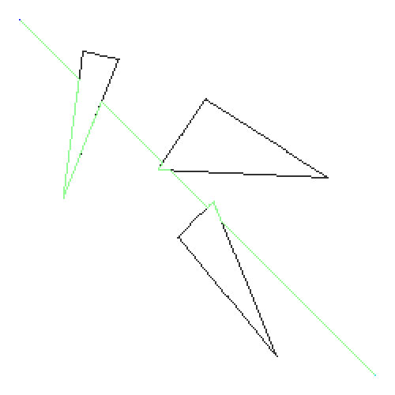
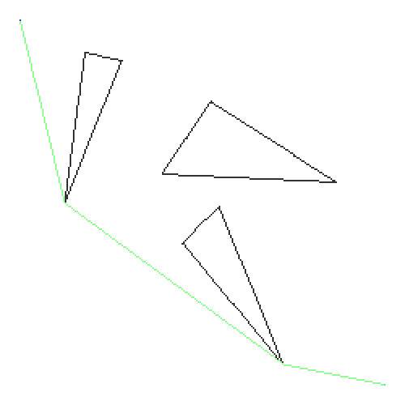

# Collection of robot motion planning examples
## Simple arm

Task: Move arm from blue position (start) to light blue position (goal) without touching the rectangles. 
The arm's movement is described by two angles, one at the base of the robot, and one at joint of the two arms.

First convert to configuration space (c-space): The axes are now the angles (instead of x/y coordinates).
To solve the problem we search for a path from start conf. to goal conf. in the c-space.

The path tells us how to change the angles of the arm over time to reach the goal position. As animation:

## Path finding algorithms

| Single Query (variant) | Bug 0 | Bug 2 |
| ---------------------- | ----- | ----- |
|  |  |  |
| Explore space and build a graph by randomly expanding nodes | Go around obstacles and leave as soon as possible | Go around obstacles and leave when crossing the line from start to goal again | 

| Visibility graph | | Voronoi |
| ---------------- | --- | ------- |
|  |  |  |
| Build a graph by connecting all vertices that see each other (edges of polygons count as well) |  | Use a voronoi diagram and move along the space that is furthest away from obstacles | 

| Potential function | |  |
| ---------------- | --- | --- |
|  |  |  |
| Create potential functions: One that pushes towards the goal, and one that pushes away from obstacles | The potential functions as heatmap | | 
