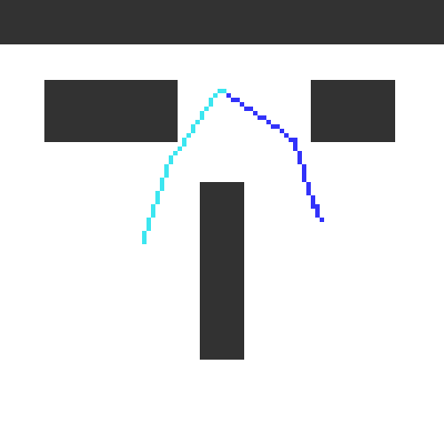

# Robot motion planning example with simple arm

Task: Move arm from black position (start) to grey position (goal) without touching the rectangles. 
The arm's movement is described by two angles, one at the base of the robot, and one at joint of the two arms.

First convert to configuration space (c-space): The axes are now the angles (instead of x/y coordinates).
To solve the problem we search for a path from start conf. to goal conf. in the c-space.

The path tells us how to change the angles of the arm over time to reach the goal position. As animation:

