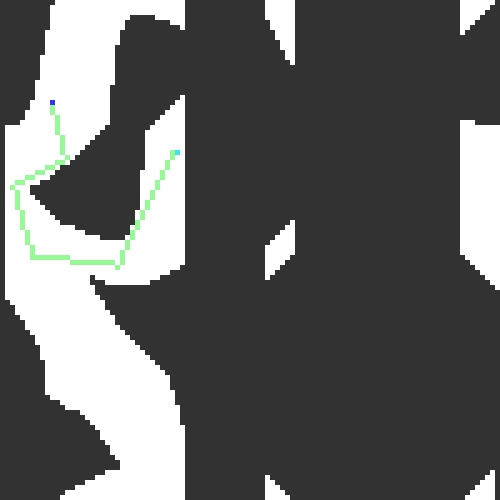
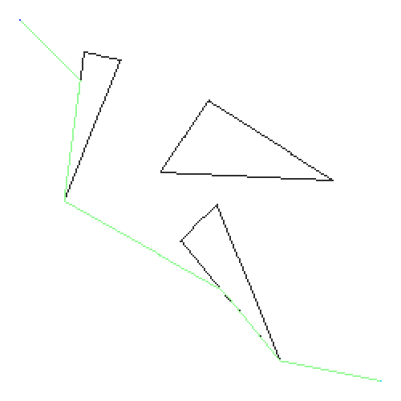

# Collection of robot motion planning examples
## Simple arm

Task: Move arm from blue position (start) to light blue position (goal) without touching the rectangles. 
The arm's movement is described by two angles, one at the base of the robot, and one at joint of the two arms.

First convert to configuration space (c-space): The axes are now the angles (instead of x/y coordinates).
To solve the problem we search for a path from start conf. to goal conf. in the c-space.

The path tells us how to change the angles of the arm over time to reach the goal position. As animation:

## Path finding algorithms

Single Query (used above for the simple arm) creates a graph by randomly expanding nodes until a path to the goal is collision free.
The Bug algorithms go around colliding obstacles. In Bug 0 the obstacle is left as soon as possible, in Bug 2 the obstacle is left when crossing the (bee) line from the start to goal.

| Single Query (variant) | Bug 0 | Bug 2 |
| ---------------------- | ----- | ----- |
|  |  |  |
